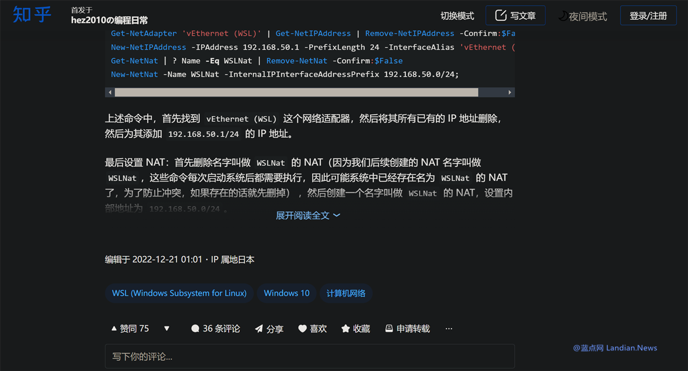
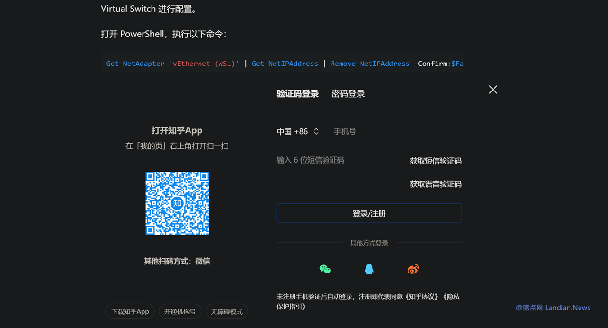

# 知乎开始强制要求用户登录账号 否则不允许查看完整回答和专栏内容
- 发布时间：2024年5月26日 19:20
- 作者：山外的鸭子哥
- 原文链接：https://www.landiannews.com/archives/104111.html

知乎多年来都会一直使用弹窗要求用户登录账号，只要是打开知乎子页面就容易出现这类弹窗非常烦人，但至少此前不登录账号仍然可以继续查看内容，所以有不少开发者推出暴力猴脚本可以自动关闭窗口。

这种情况现在已经有所改变，所有的暴力猴脚本都已经失效，因为知乎开始强制要求用户必须登录账号后才能查看完整内容。

涉及的包括知乎问答里的完整回答和知乎专栏的完整内容，在没有登录的情况下现在不会直接弹出窗口，但当用户点击查看完整内容时，就会弹出登录窗口。

和之前不同的是关闭登录窗口无济于事，因为从 F12 控制台的数据来看，在没有登录的情况下知乎压根就没有传输完整的数据，所以单纯的屏蔽登录窗口是没用的，因此这也会给通过技术手段绕过登录带来很大的困难。

目前尚不清楚知乎为什么进行这样的调整，知乎目前的营收和股价都非常非常难看，本来通过弹出登录窗口也是希望获得更多新用户来让数据更好看些，现在强制登录估计目的已经不只是活跃用户数据问题。

现在人工智能训练需要大量的数据，知乎这些年积攒的数据对人工智能模型来说是个巨大的宝库，所以知乎改成强制登录或许是为了避免自己的数据被直接抓取。

另一方面尽管知乎现在的口碑不怎么好但知乎上确实存在很多优质内容，大家通过搜索引擎检索内容时有很大概率会碰到知乎的内容，所以接下来要么用户注册账号并登录，要么就只能彻底屏蔽知乎了。