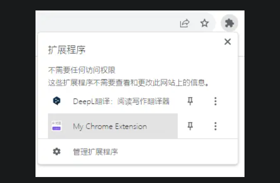
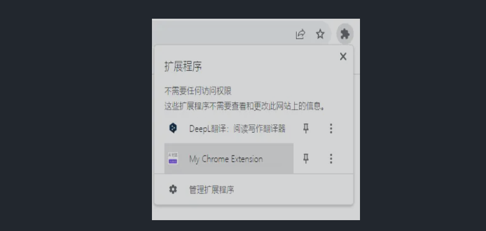

# 目录
- [编写这个插件的开端](#编写这个插件的开端)
- [研究过程](#研究过程)
- [开始测试!](#开始测试)
- [自动化](#自动化)
# 编写这个插件的开端
当我兴致勃勃地逛知乎专栏时，突然看到底下出现“展开阅读全文”，结果弹出一个登录窗口，关闭后也没有任何反应，还是没有展开，再打开`F12`一看，妈的，根本就没有传输完整内容！

<video src="zhihu/安装前.mp4" controls="controls"></video>

> [!TIP]
> 详细信息请看[蓝点网的文章](https://www.landiannews.com/archives/104111.html)或[本仓库存档](landiannews-bak.md)。

# 研究过程
这时我发现一个微妙逻辑：
- 不登录直接访问知乎网页时，点击“展开阅读全文”后网页会自动跳转到登录页面，评论可见；
- 但在知乎APP中打开页面，即使**不登录**也能查看完整内容，评论不能直接看到；
- 但如果使用知乎APP的UA访问网页时，就可以直接查看完整内容，同时发现地址变为`https://www.zhihu.com/appview/p/*`，但无法查看评论；
- 同时，即使不使用知乎APP的UA，直接访问`https://www.zhihu.com/appview/p/*`也是完整内容，但是文字排版有问题，同时看不到评论

如果将`https://www.zhihu.com/appview/p/*`中加载的完整内容替换到原本的页面不就搞定了吗？

# 开始测试

1. 找一篇足够长的文章，比如`https://zhuanlan.zhihu.com/p/667279362`，
2. 滑到底发现有“展开完整内容”

<video src="zhihu/修改网址.mp4" controls="controls"></video>

3. 将地址改为 `https://www.zhihu.com/appview/p/667279362` ，文章全部加载出，但没有评论
<video src="zhihu/HTML替换大法.mp4" controls="controls"></video>
4. 直接使用HTML替换大法，删除“展开阅读全文”按钮，完成！
<video src="zhihu/已知问题.mp4" controls="controls"></video>
5. 但是发现一些问题：图片不加载，显示比例错误，超链接不显示……本人能力有限，坐等大佬修复

- `https://www.zhihu.com/appview/p/*` 中，图片宽高比正常

- `https://zhuanlan.zhihu.com/p/*` 中宽高比不正常

# 自动化

当然作为一名程序员，每次都手动修改网址并打开F12手动替换元素，这些操作非常的繁琐。所以我就写了一个插件，解放双手！本插件使用 ChatGPT-4o 编写，本人代码小白，暂时只能实现点击展开全文后自动跳转页面，后续坐等大佬提交